# 🚛 Turkey Logistics Decision-Support System

A **portfolio-quality transportation optimization tool** for a Turkish logistics network, built with Python, PuLP, and Streamlit.

🔗 **Live demo:** [turkey-logistics-dss-33hou3yq4gqkhaiejjrglh.streamlit.app](https://turkey-logistics-dss-33hou3yq4gqkhaiejjrglh.streamlit.app)

---

## Dashboard

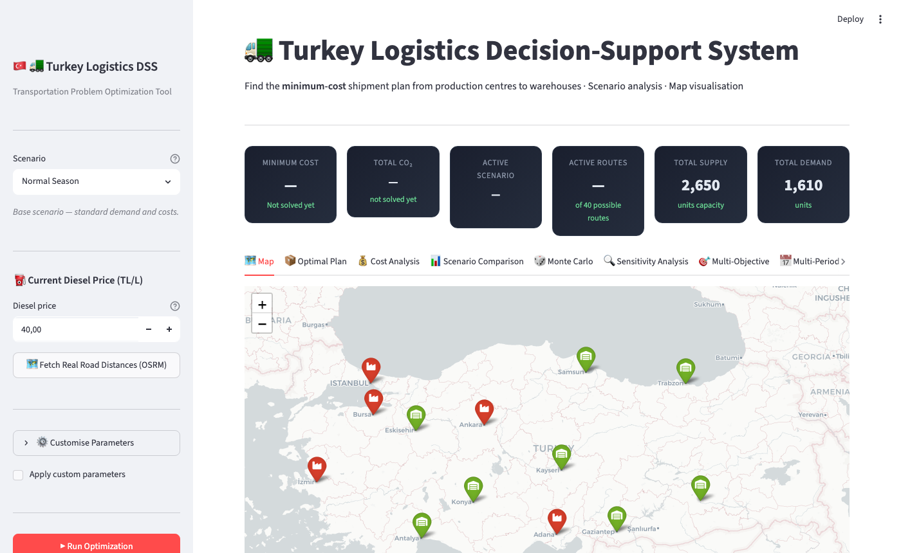

---

## 🗺️ Interactive Route Map

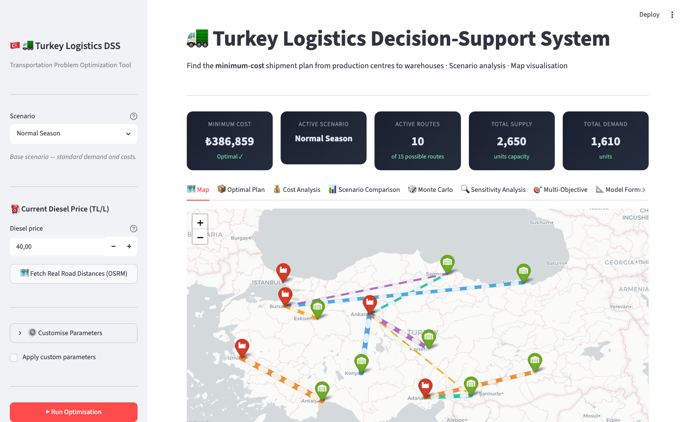

Animated routes on a Turkey map — line thickness proportional to shipment volume. Red = production centres, green = warehouses.

---

## 📦 Material Flow — Sankey Diagram

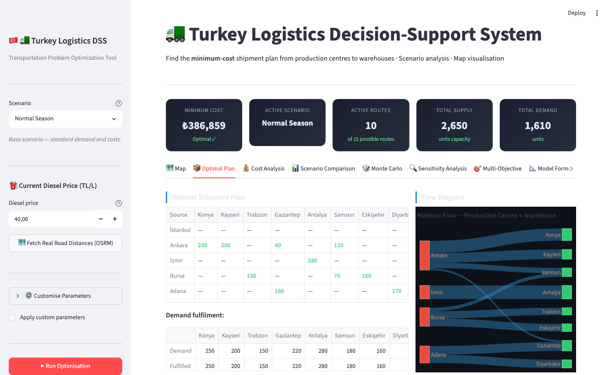

---

## 💰 Cost Breakdown & Heatmap

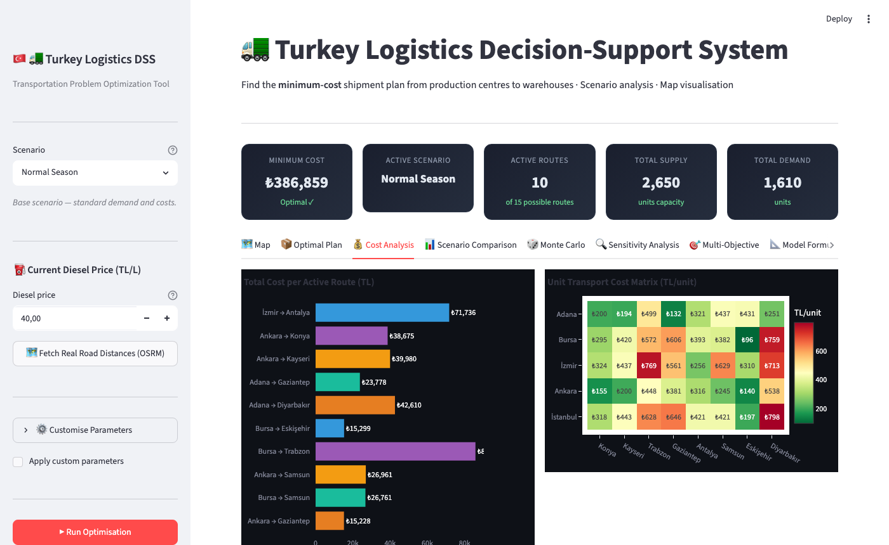

---

## 📊 Scenario Comparison

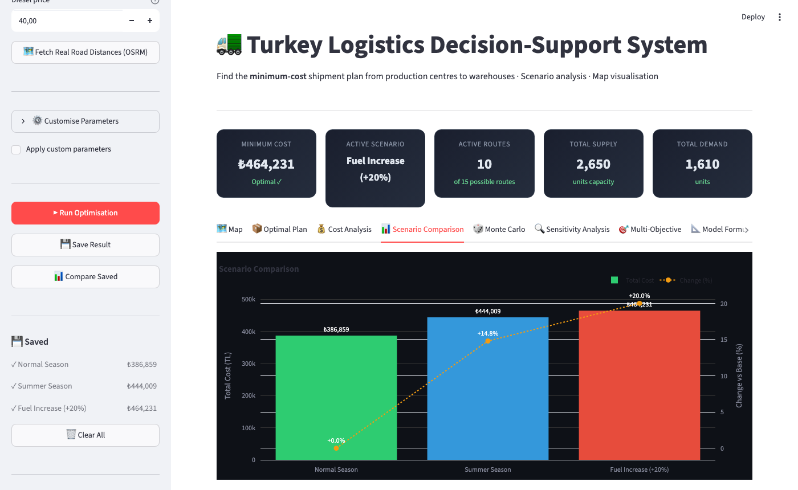

Four built-in scenarios: **Normal Season · Summer Season · Fuel Increase (+20%) · Winter Season**. Save any solved scenario and compare side-by-side.

---

## 🔍 Sensitivity Analysis

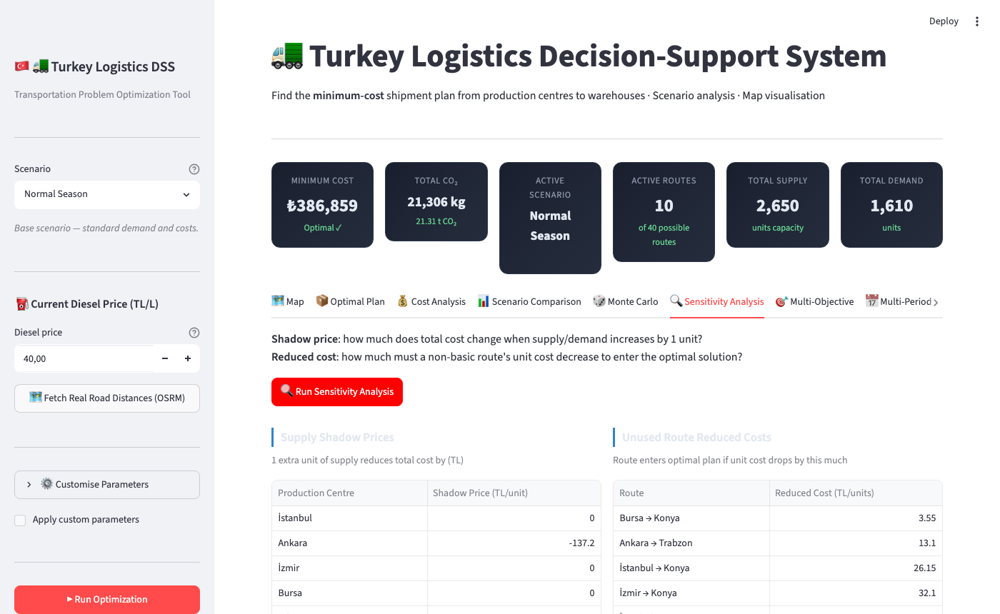

Shadow prices (dual variables) show which supply/demand constraints are most valuable to relax. Reduced costs reveal how close inactive routes are to entering the optimal solution.

---

## 🎲 Monte Carlo Simulation

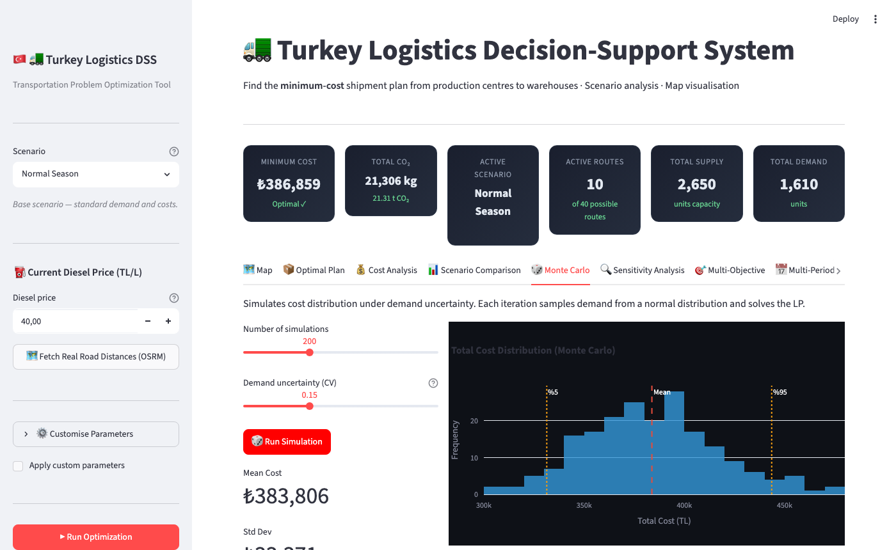

Simulates cost distribution under demand uncertainty (truncated normal, CV = 0.15, N = 300 iterations). Shows mean, 5th/95th percentile, and per-route reliability heatmap.

---

## 🎯 Multi-Objective Pareto Frontier

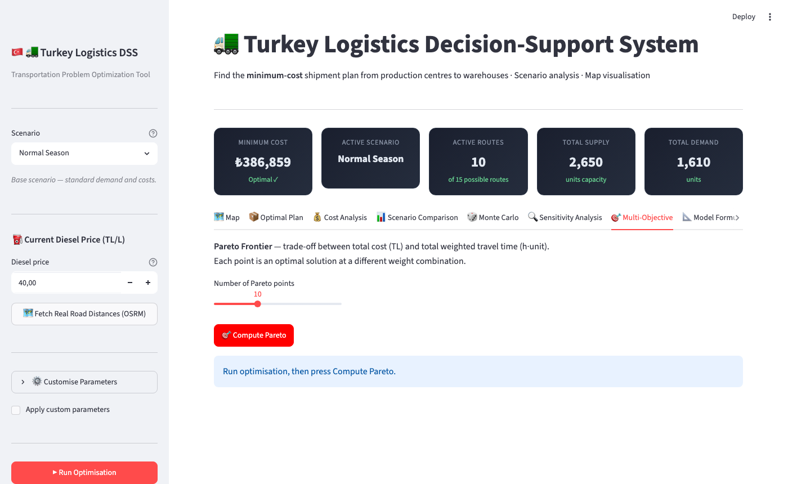

Weighted-sum scalarisation sweeps α ∈ [0, 1] between cost minimisation and travel-time minimisation, tracing the Pareto-optimal frontier.

---

## 📅 Multi-Period Planning (4-Quarter LP)

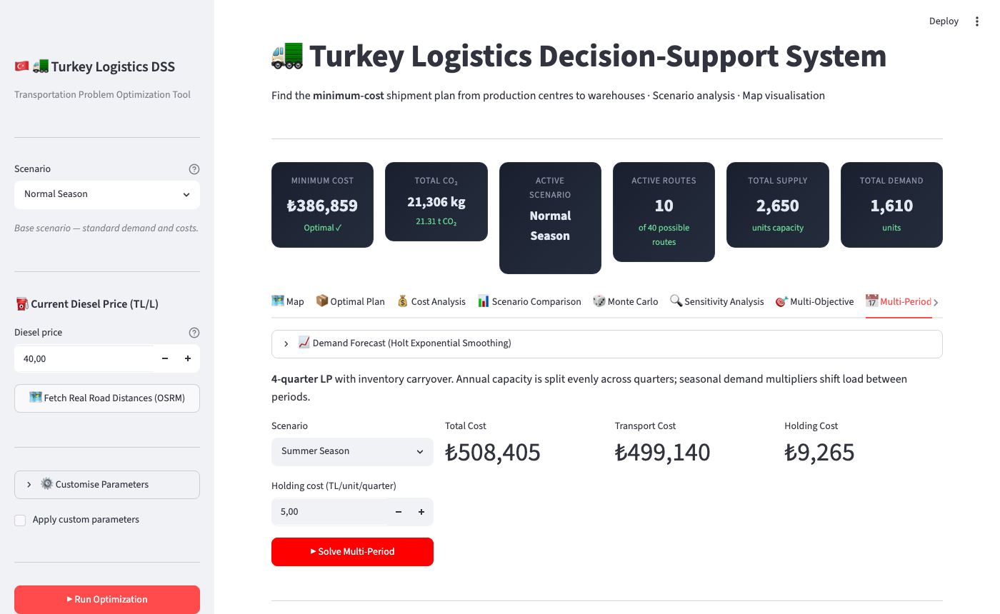

4-quarter transportation LP with inventory carryover. Annual capacity split evenly per quarter; seasonal demand multipliers shift load between periods. Stacked bar chart shows transport vs. holding cost per quarter.

---

## 📈 Demand Forecasting

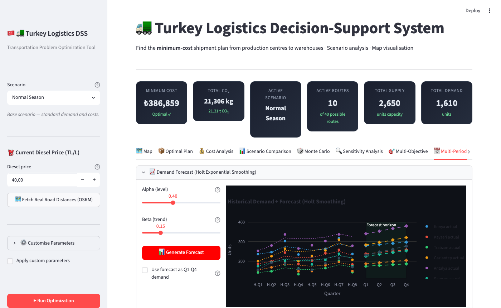

Holt double-exponential smoothing on 8 quarters of synthetic historical data. Forecasts next 4 quarters per warehouse with configurable α/β. Forecast output can feed directly into the multi-period LP.

---

## ⚠️ Disruption Simulation

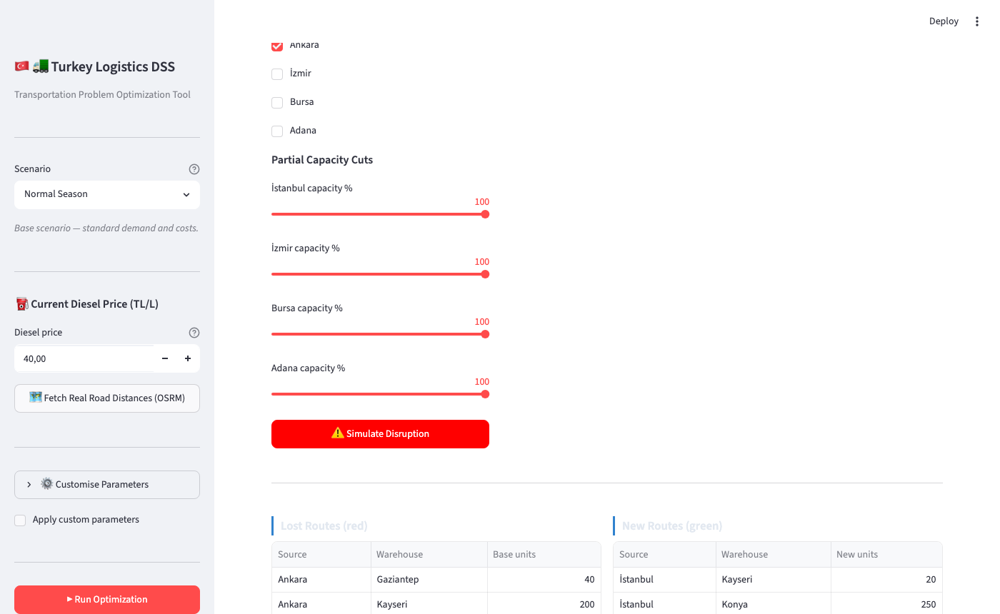

Disable or partially reduce source capacity to model supply chain disruptions. Compares base vs. disrupted optimal plans — shows cost delta, lost/new routes, and a colour-coded map (blue = unchanged, red = lost, green = new).

---

## 📍 Facility Location (P-Median)

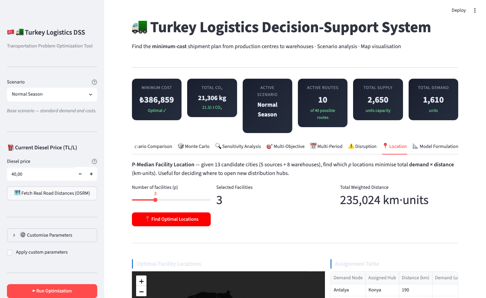

P-Median binary MIP: finds which *p* of 13 candidate cities (5 sources + 8 warehouses) to open as distribution hubs to minimise total demand-weighted distance. Includes an elbow curve to guide the choice of p.

---

## 🏗️ System Architecture

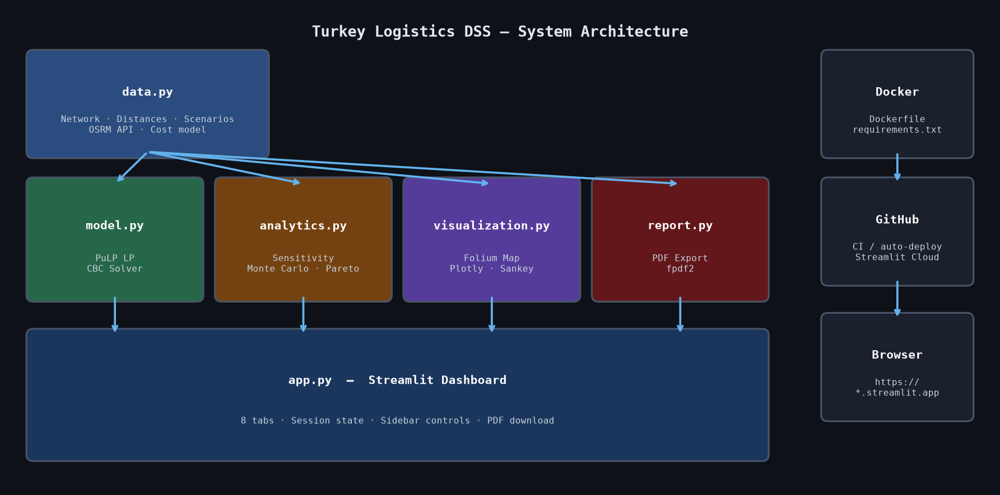

---

## 🎯 What it does

Finds the **minimum-cost shipment plan** from 5 production centres to 8 warehouses across Turkey using Linear Programming (Simplex method), then layers eight analytical modules on top.

## 🗺️ Network

| Production Centres | Warehouses |
|---|---|
| İstanbul, Ankara, İzmir, Bursa, Adana | Konya, Kayseri, Trabzon, Gaziantep, Antalya, Samsun, Eskişehir, Diyarbakır |

**Total supply:** 2,650 units · **Base demand:** 1,610 units · **Slack:** 1,040 units

## 🧮 Mathematical Model

$$\min Z = \sum_{i \in I} \sum_{j \in J} c_{ij} x_{ij}$$

Subject to:
- $\sum_{j} x_{ij} \leq s_i \quad \forall i$ — supply capacity
- $\sum_{i} x_{ij} \geq d_j \quad \forall j$ — demand fulfilment
- $\sum_{ij} e_{ij} x_{ij} \leq B$ — optional CO₂ emission cap
- $x_{ij} \geq 0 \quad \forall i, j$

**Model size:** 40 decision variables · 13 constraints (+ optional CO₂ constraint)

## 💰 Cost Estimation

$$c_{ij} = \frac{d_{ij} \cdot \frac{L}{100} \cdot p_f \;+\; \frac{d_{ij}}{v} \cdot w \;+\; \tau_{ij} \;+\; f}{q}$$

| Parameter | Value |
|---|---|
| Fuel consumption | 30 L / 100 km |
| Diesel price $p_f$ | 40 TL/L (live input) |
| Driver wage $w$ | 150 TL/h |
| Avg speed $v$ | 80 km/h |
| HGS/OGS tolls $\tau_{ij}$ | Route-specific |
| Load/unload fee $f$ | 200 TL |
| Truck capacity $q$ | 25 units |
| CO₂ factor | 2.68 kg/L (IPCC) |

## 🚀 Run locally

```bash
pip install -r requirements.txt
streamlit run app.py
```

For development (linting + coverage), install the dev extras instead:

```bash
pip install -r requirements-dev.txt
ruff check .                 # lint
python -m pytest tests/ --cov=.   # tests + coverage
```

## ⚙️ Configuration — no hardcoded data

The network is defined entirely by editable files under `network/` — **no code
changes are needed to model a different network**:

| File | Contents |
|---|---|
| `network/sources.csv` | Production centres (capacity, lat/lon, colour) |
| `network/warehouses.csv` | Warehouses (demand, lat/lon, colour) |
| `network/distances.csv` | Source × warehouse road distances (km) |
| `network/tolls.csv` | Source × warehouse HGS/OGS tolls (TL) |
| `network/config.yaml` | Cost parameters + scenario definitions |

Runtime overrides via environment variables:

```bash
NETWORK_DIR=/path/to/my_network   # load a completely different network
FUEL_PRICE_TL_PER_LITRE=55        # override any cost parameter
LP_SOLVER=highs                   # swap CBC → HiGHS (falls back to CBC)
```

## 🐳 Run with Docker Compose (API + Streamlit)

```bash
docker compose up
# Streamlit → http://localhost:8501
# FastAPI    → http://localhost:8000/docs
```

## 🧪 Tests

```bash
python -m pytest tests/ -v   # 138 tests (LP, analytics, API, solver)
```

## 📦 Tech Stack

| Layer | Tools |
|---|---|
| Optimization | PuLP · CBC Simplex / HiGHS (pluggable via `LP_SOLVER`) · Binary MIP (p-median) |
| Forecasting | Holt double-exponential smoothing (NumPy) |
| Web App | Streamlit (11-tab dashboard) |
| REST API | FastAPI + Pydantic + Uvicorn |
| Maps | Folium + streamlit-folium |
| Charts | Plotly (Sankey · Heatmap · Bar · Scatter) |
| Analytics | NumPy · SciPy |
| Export | fpdf2 (PDF) · openpyxl (Excel) |
| Road Distances | OSRM API (with fallback) |
| Config | CSV + YAML network files · env-var overrides |
| Quality | Ruff lint · pytest-cov coverage |
| CI/CD | GitHub Actions (ruff + pytest) · Streamlit Community Cloud |
| Containerisation | Docker Compose |

## 📁 Project Structure

```
turkey_logistics/
├── app.py               # Streamlit orchestrator (wires sidebar → solver → tabs)
├── views/               # One module per dashboard tab + sidebar/header/styles
│   ├── sidebar.py  header.py  styles.py
│   └── tab_map.py  tab_plan.py  tab_cost.py  …  tab_model.py
├── network/             # Editable network data (no hardcoding)
│   ├── sources.csv  warehouses.csv  distances.csv  tolls.csv  config.yaml
├── solver.py            # Central PuLP solver factory (CBC / HiGHS via LP_SOLVER)
├── model.py             # PuLP LP solver (+ CO₂ budget constraint)
├── data.py              # Loads network/ files; OSRM /table client (cached)
├── analytics.py         # Sensitivity, Monte Carlo, Pareto
├── visualization.py     # Folium maps + Plotly charts
├── multiperiod.py       # 4-quarter LP with inventory
├── forecasting.py       # Holt exponential smoothing
├── disruption.py        # Supply disruption simulation
├── pmedian.py           # P-Median facility location MIP
├── excel_export.py      # Excel report generator
├── report.py            # PDF report generator
├── report_ieee.tex      # IEEE-format LaTeX paper
├── api/                 # FastAPI backend (main.py, schemas.py, routes/)
├── tests/               # pytest suite (138 tests, incl. API + solver)
├── ruff.toml            # Linter configuration
├── docker-compose.yml
├── requirements.txt     # Runtime deps
└── requirements-dev.txt # + ruff, pytest-cov, httpx
```

---

*Transportation Problem · Linear Programming · P-Median · Holt Forecasting · Disruption Simulation · Python · Streamlit*
